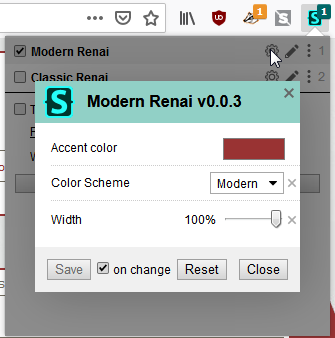
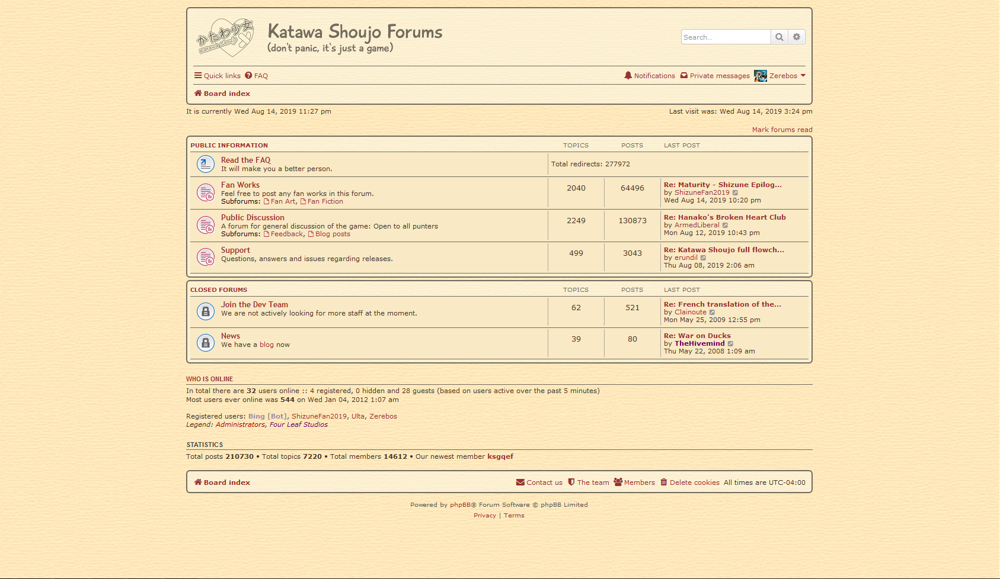
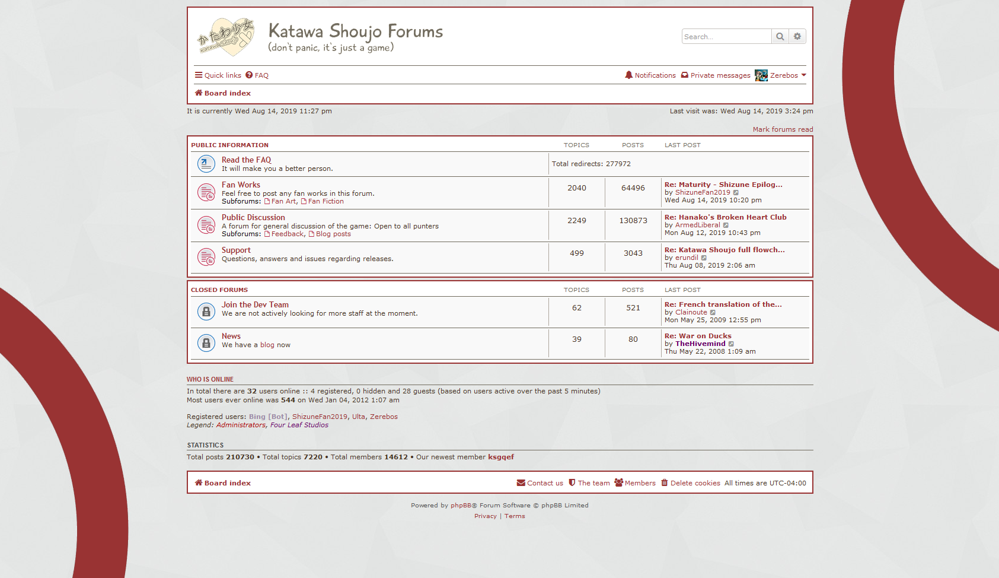
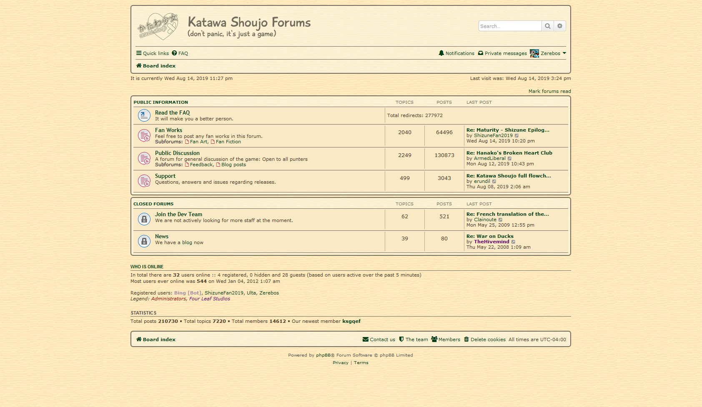
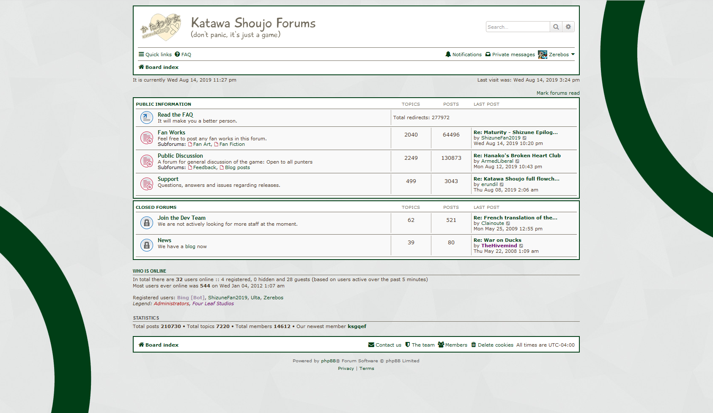
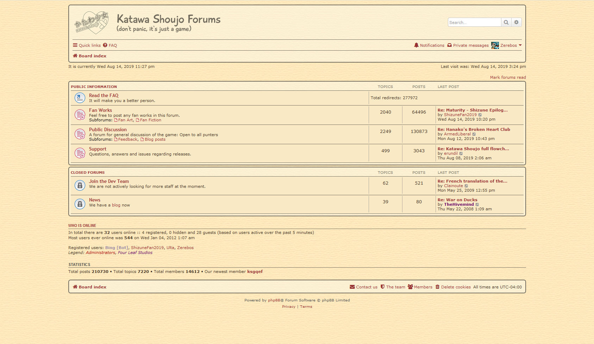

# ModernRenai 
A UserCSS theme for the Katawa Shoujo forums on the Ren'Ai. Check down below for some previews!

## Installation

### 1. Get Stylus
First install the Stylus extension for your browser:

1. [Chrome](https://chrome.google.com/webstore/detail/stylus/clngdbkpkpeebahjckkjfobafhncgmne)
2. [Firefox](https://addons.mozilla.org/firefox/addon/styl-us/)
3. [Opera](https://addons.opera.com/extensions/details/stylus/) (see [wiki](https://github.com/openstyles/stylus/wiki/Opera,-Outdated-Stylus) for more recent version)

### 2. Get Theme

Click the badge at the top of this README or click here: [https://rauenzi.github.io/ModernRenai/ModernRenai.user.css](https://rauenzi.github.io/ModernRenai/ModernRenai.user.css)

### 3. Configure

Configure to your liking with the options below and you're ready to go! To get to the config screen, click the Stylus icon in your browser, then select the cog icon next to the theme.

## Options

## Color Scheme

There are two options for color schemes in this theme.
 - `Classic` - this will remind you of how the forums used to look.
 - `Modern` - this is a more modern take on the original forums using more light colors and sharp edges.

Default: `Classic`

### Classic

### Modern

## Accent Color

This is the main color throughout the forums. Back in the original forum this was a nice red color. You can change this to whatever you like and it will work in both Classic and Modern schemes.

Default: `#993333`

### Classic w/ Green

### Modern w/ Green

## Screen Width

This adjusts the width of the forum relative to the maximum possible width of the forum (`1300px`). Adjustable to allow for different reading preferences.

Default: `65%`

### Classic Full-Width

### Modern Full-Width

